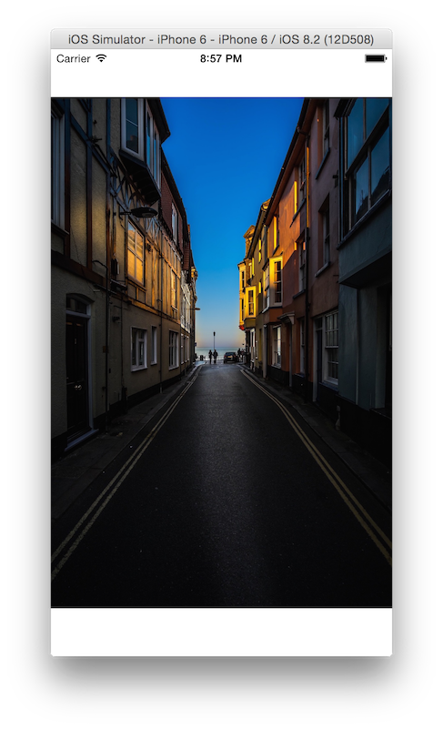

## Learn how to fill an image view without clipping

[How to get an image to fill an image view – without any clipping](http://roadfiresoftware.com/2015/03/how-to-get-an-image-to-fill-an-image-view-without-any-clipping/)

